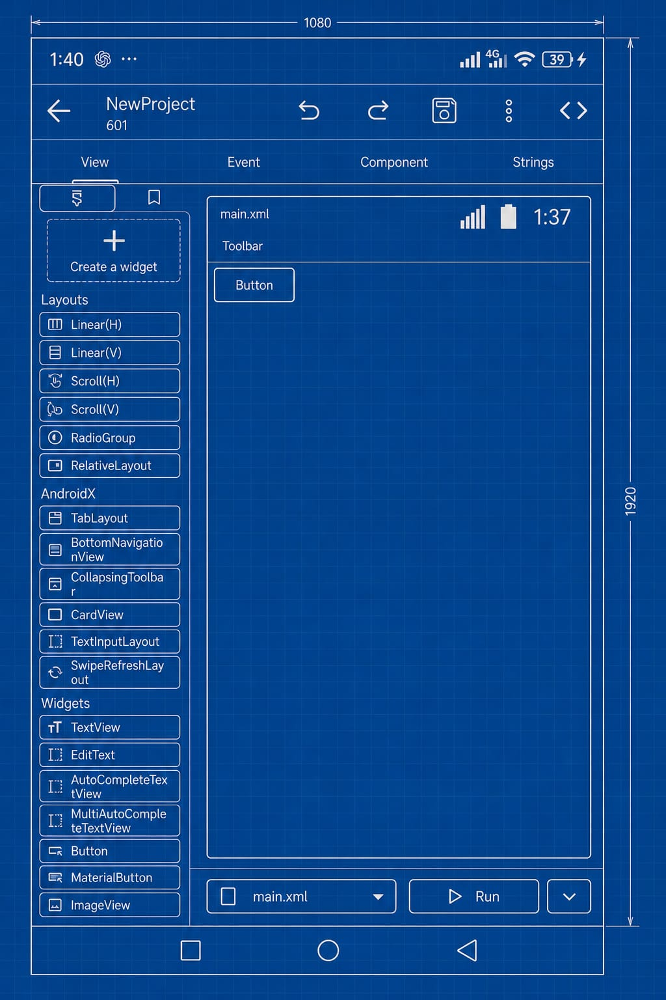

<p align="center">
  
</p>

<h1 align="center">Sketchware IA</h1>

<p align="center">
  A community-maintained, source-available continuation of Sketchware Pro for Android creators.
</p>

<p align="center">
  <a href="https://github.com/FabioSilva11/Sketchware-IA/actions/workflows/android.yml"></a>
  <a href="https://github.com/FabioSilva11/Sketchware-IA/commits/main"></a>
  <a href="https://github.com/FabioSilva11/Sketchware-IA/pulls"></a>
  <a href="LICENSE.md"></a>
</p>

> [!NOTE]
> This README is written in English to make the repository easier to discover globally. Portuguese-speaking contributors are very welcome.

Sketchware IA keeps the Sketchware experience alive with community-driven fixes, editor improvements, build tooling, and long-term maintenance. This repository is the main home for the Android app source code, contribution workflow, and project automation.

<p align="center">
  
</p>

> [!IMPORTANT]
> Sketchware IA is source-available, not a conventional open-source project. Please read [LICENSE.md](LICENSE.md) before reusing code outside this repository.

## Why this project exists

Sketchware changed how many people learned Android development on mobile. Sketchware IA exists to preserve that experience, improve it with community work, and keep the project accessible to new and experienced creators alike.

## Highlights

- Community-maintained continuation of Sketchware Pro.
- Android app source code built with Gradle, Java, Kotlin, and modern AndroidX dependencies.
- Project editing, resource management, preview tooling, import/export flows, and custom component support.
- GitHub Actions workflow for reproducible CI builds.
- Structured issue forms, pull request template, security policy, and contribution guidelines.

## Quick Start

### Requirements

- Android Studio with JDK 17 support.
- Android SDK configured locally.
- Git.

### Build locally

```bash
git clone https://github.com/FabioSilva11/Sketchware-IA.git
cd Sketchware-IA
./gradlew assembleRelease
```

On Windows, use:

```powershell
.\gradlew.bat assembleRelease
```

### Optional environment variables

- `GOOGLE_SERVICES_JSON` or `GOOGLE_SERVICES_JSON_BASE64` for Firebase-related setup.
- `SKETCHUB_API_KEY` for integrations that depend on Sketchub services.

## Repository Map

| Path | Purpose |
| --- | --- |
| `app/` | Main Android application source, resources, manifest, and Gradle module. |
| `.github/` | Workflows, issue forms, templates, and repository automation. |
| `assets/` | Branding assets and shared project images. |

## AI Error Fix Audit

The Android compile-log explanation and AI-assisted error-fix flow can be audited directly in the following files:

| Path | Responsibility |
| --- | --- |
| `app/src/main/java/com/besome/sketch/tools/CompileLogActivity.java` | Displays compile logs, triggers AI explanation, resolves the target screen/event, and launches the AI Fix flow. |
| `app/src/main/res/layout/compile_log.xml` | UI for the compile log screen, including the AI Explain and AI Fix buttons. |
| `app/src/main/java/pro/sketchware/ai/fix/AiFixSupport.java` | Builds AI prompts, parses compile errors, maps Java compile failures to logic events, and requests structured fix suggestions. |
| `app/src/main/java/pro/sketchware/ai/fix/AiFixSession.java` | Serializable session object that carries compile-log context, resolved target metadata, and generated Java source for the fix flow. |
| `app/src/main/java/pro/sketchware/ai/fix/AiFixSessionStore.java` | Persists and restores AI Fix sessions between Activities. |
| `app/src/main/java/pro/sketchware/ai/fix/AiFixSuggestion.java` | Parses the AI JSON response into structured operations and manual steps. |
| `app/src/main/java/com/besome/sketch/editor/LogicEditorActivity.java` | Receives the AI Fix session, asks the AI for a safe block patch, shows the suggestion, and applies supported operations to blocks. |
| `app/src/main/java/pro/sketchware/logic/LogicSyntaxChecker.java` | Runs a local syntax pass on generated logic code before or after fixes. |
| `app/src/main/java/mod/jbk/diagnostic/CompileErrorSaver.java` | Saves and restores the last compile error shown by the compile-log screen. |
| `app/src/main/java/com/besome/sketch/design/DesignActivity.java` | Captures build failures and routes users to the compile-log screen. |

## AI Layout Generation Audit

The AI layout-generation flow can be audited directly in the following files:

| Path | Responsibility |
| --- | --- |
| `app/src/main/java/com/besome/sketch/design/DesignActivity.java` | Opens the AI layout-generation dialog, validates the prompt, shows loading states, and applies the generated layout to the editor. |
| `app/src/main/res/layout/dialog_ai_layout_generation.xml` | Main dialog UI for describing the layout request and optionally including the current layout as context. |
| `app/src/main/res/layout/dialog_ai_layout_loading.xml` | Loading dialog UI reused while the AI prepares or applies the generated layout. |
| `app/src/main/java/pro/sketchware/ia/GeradorDeLayout.java` | Builds the AI prompt, includes layout/history context, requests the generated XML, and sanitizes the returned layout. |
| `app/src/main/java/pro/sketchware/ia/LayoutHistoryManager.java` | Stores recent layout-generation history so follow-up refinement requests can keep context. |

## Contributing

We welcome bug fixes, UI polish, performance work, documentation improvements, and carefully scoped new features.

Before opening a pull request:

1. Read [CONTRIBUTING.md](CONTRIBUTING.md).
2. Keep your change focused and well described.
3. Test the affected flow locally whenever possible.
4. Use a clear commit message such as `fix: prevent crash on project import`.

If you are new here, documentation, bug reproduction, and cleanup PRs are excellent ways to get started.

### Translation Requirement

Every new user-facing feature must be translation-ready.

- Add all visible UI text to `app/src/main/res/values/strings.xml` instead of hardcoding text in Java, Kotlin, XML layouts, menus, dialogs, toasts, snackbars, or bottom sheets.
- This project supports external translations through `sketchware/localization/strings.xml`, so new strings must exist in the app resources first.
- If a text is assigned after inflation or inside code paths that do not rely only on XML resource inflation, use `getString(...)` or `TranslationFunction.getString(...)` so the external translation layer can still replace it correctly.
- This rule also applies to AI features, including chat, provider settings, AI layout generation, AI Explain, AI Fix, and any future AI screens or dialogs.

## Community

- Telegram: [t.me/sketcware_ia](https://t.me/sketcware_ia)
- Support the project: [Patreon](https://www.patreon.com/sketchware)

## Security

Please do not report security issues in public issues. Follow the instructions in [SECURITY.md](SECURITY.md).

## Disclaimer

Sketchware IA is a community effort made to preserve and improve the Sketchware experience. Do not publish this project, or modified versions of it, to app stores as if it were an official release. Read [LICENSE.md](LICENSE.md) for the copyright and reuse context before redistributing code or binaries.

If this project helps you, star the repository, share it with other builders, and consider contributing a pull request.
